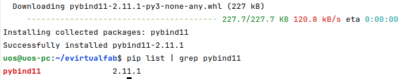
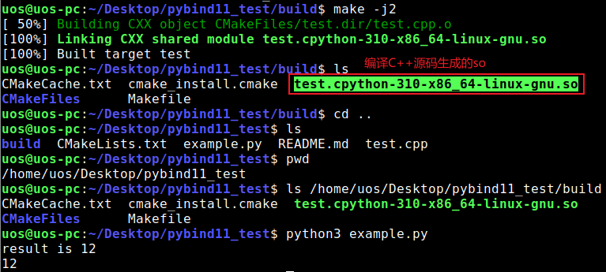

# 说明

This is a demo for pybind11. 这是一个演示如何使用pybind11的例子，通过pybind11绑定后，在python中可以直接通过imort方式调用C++ so库。

# 背景

我们通常在 Python 上进行算法开发，因为 Python 编程方便，易于快速验证算法。而在验证算法正确后，如果对运行效率有更高要求的话，则会将计算密集的模块使用 C/C++ 重新实现，来达到代码运行效率加速的效果。所以，这就涉及到了 Python 和 C++ 混合编程，而在这方面 pybind11 是一个很流行的库，可以很好的开展 Python 和 C++ 混合编程，并通过 Python 的 **import 直接调用**动态链接库（.so/.pyd等）达到本地代码加速。

# 使用方式

先要在python环境中使用pip install pybind11安装pybind11，结果如下图：



然后在系统中安装 pybind11-dev。

```bash
mkdir build

cd build

cmake ..

make -j4
```


#### 运行

在Ubuntu 22.04上运行结果如下图：




本例中 example.py使用sys.path.insert(0, '/home/uos/Desktop/pybind11_test/build')将生成的so路径添加到系统路径中，实际应用中，可以将so打包成whl包后直接安装到python环境中使用。

# 参考文档

* [Python 和 C++ 混合编程：pybind11 使用-CSDN博客]([Python 和 C++ 混合编程：pybind11 使用-CSDN博客](https://blog.csdn.net/i6101206007/article/details/131005851))

* https://www.cnblogs.com/linxmouse/p/9105494.html

  
